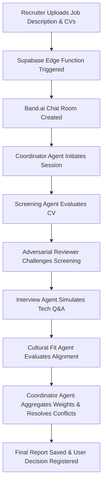

# Hire 🚀 - AI-Powered Automated Recruitment Orchestrator

Hire is a state-of-the-art recruitment orchestration platform designed to automate and elevate enterprise hiring workflows. By leveraging a collaborative network of specialized AI agents, Hire screens candidates, conducts simulated technical interviews, assesses cultural fit, detects biases, and synthesizes final recommendations—all visualizable in real-time.

Submitted for the **Band of Agents Hackathon** under **Track 1: Internal Enterprise Workflows**.

---

## 📖 Table of Contents
- [Core Mission](#-core-mission)
- [How It Works (Hiring Workflow)](#-how-it-works-hiring-workflow)
- [The Multi-Agent Architecture](#-the-multi-agent-architecture)
- [Technology Stack](#-technology-stack)
- [AI Models & APIs Integration](#-ai-models--apis-integration)
- [Setup & Deployment](#-setup--deployment)
- [Roadmap & Future Scope](#-roadmap--future-scope)

---

## 🎯 Core Mission

Traditional hiring processes are time-consuming, prone to human bias, and costly. **Hire** solves this by establishing a structured, automated pipeline where specialized AI agents collaborate, challenge each other's decisions, and produce comprehensive hiring dossiers. By automating the top-of-funnel screening and simulation, human recruiters can make faster, highly-informed, and fairer hiring decisions.

---

## 🔄 How It Works (Hiring Workflow)



1. **Upload & Parse:** A recruiter inputs a job description and uploads candidate CVs (parsed locally on-the-fly).
2. **Orchestration:** A central orchestration call deploys a multi-agent workflow in the backend.
3. **Collaboration:** The agents join a dedicated chat room on **Band.ai**, interacting and passing contexts.
4. **Human-in-the-Loop:** Recruiters review structured reports, read the raw agent discussions, and log the final hire/reject decision.

---

## 🤖 The Multi-Agent Architecture

We use five specialized agents to ensure a comprehensive 360-degree evaluation:

1. **Coordinator Agent:** The orchestrator. Creates the room, welcomes the agents, aggregates scores using weighted formulas, identifies conflicting opinions, and writes the executive summary.
2. **CV Screening Agent:** Evaluates candidate CVs objectively against job requirements, rating strengths and match accuracy.
3. **Adversarial Reviewer:** Critically reviews the screening decision to detect biases, inconsistencies, or overlooked qualifications (ensuring fair hiring).
4. **Technical Interview Agent:** Simulates a live technical interview based on candidate experience, generating relevant questions and simulated answers.
5. **Cultural Fit Agent:** Examines work history and company values to assess team compatibility and adaptability.

---

## 🛠 Technology Stack

* **Frontend:** Built with **Flutter (Dart)**, utilizing a highly responsive, modern, and adaptive UI supporting both **Dark & Light Modes** out of the box. Compatible with Web and Mobile.
* **Backend:** **Supabase** acting as a serverless database, providing real-time data sync (via WebSockets) for displaying the active agent chats.
* **Serverless Functions:** **Supabase Edge Functions (Deno)** to securely execute the multi-agent logic, handle HTTP orchestrations, and keep API keys protected.
* **State Management:** **Bloc/Cubit** pattern for predictable, reactive UI updates.

---

## 🔌 AI Models & APIs Integration

To ensure the best balance between performance, speed, cost, and open-source flexibility, we integrated:

### 1. Band.ai (Agent Collaboration & Logging)
* **Role:** Acts as the communication fabric for our agents.
* **Implementation:** The Edge Function creates a room via Band.ai API, adds the agents as participants, and posts messages as they complete their tasks. This allows recruiters to view the raw reasoning behind decisions.

### 2. AI/ML API (High-Performance LLMs)
* **Role:** Powers the core agents including the Coordinator, Screening, Interview, and Cultural Fit agents.
* **Model Used:** `gpt-4o-mini`
* **Why:** High reasoning capability, excellent JSON adherence, and fast response times make it perfect for structured evaluations.

### 3. Featherless AI (Adversarial Open-Source Model Host)
* **Role:** Powers the **Adversarial Reviewer Agent**.
* **Model Used:** `meta-llama/Llama-3.1-8B-Instruct`
* **Why:** Having an adversarial role run on a completely different model family (Llama vs GPT) ensures cognitive diversity. It prevents systemic biases that might occur if the same LLM evaluates its own output. Featherless AI allowed us to easily spin up Llama 3.1 with low latency.

---

## ⚙️ Setup & Deployment

### Backend (Supabase Edge Secrets)
To deploy the backend orchestrator, ensure you have the Supabase CLI installed, then configure the environment secrets:

```bash
# Set up API keys securely in the backend
supabase secrets set AIMLAPI_KEY=your_aimlapi_key
supabase secrets set FEATHERLESS_KEY=your_featherless_key
supabase secrets set BAND_COORDINATOR_API_KEY=your_coordinator_key
supabase secrets set BAND_SCREENING_API_KEY=your_screening_key
supabase secrets set BAND_REVIEWER_API_KEY=your_reviewer_key
supabase secrets set BAND_INTERVIEW_API_KEY=your_interview_key
supabase secrets set BAND_CULTURAL_API_KEY=your_cultural_key

# Set agent UUIDs
supabase secrets set BAND_COORDINATOR_AGENT_UUID=your_coordinator_uuid
supabase secrets set BAND_SCREENING_AGENT_UUID=your_screening_uuid
supabase secrets set BAND_REVIEWER_AGENT_UUID=your_reviewer_uuid
supabase secrets set BAND_INTERVIEW_AGENT_UUID=your_interview_uuid
supabase secrets set BAND_CULTURAL_AGENT_UUID=your_cultural_uuid
```

### Run the App Locally
1. Clone the repository.
2. Run `flutter pub get`.
3. Configure your local `.env` file with `SUPABASE_URL` and `SUPABASE_ANON_KEY`.
4. Run the app:
   ```bash
   flutter run -d chrome  # For Web
   # or
   flutter run           # For Mobile/Desktop
   ```

---

## 🏆 Hackathon Alignment
This project was specifically crafted for **Track 1: Internal Enterprise Workflows** of the **Band of Agents Hackathon**. It demonstrates how enterprises can orchestrate multiple agents using **Band.ai** to streamline complex, sensitive internal processes like hiring while maintaining security and human-in-the-loop oversight.

---

## 🔮 Roadmap & Future Scope
This is the **initial release (v1.0)** of Hire. Our primary focus for this version was to build and demonstrate a solid foundation for **live multi-agent collaboration, interaction, and context handoff** through Band.ai.

In future releases, we plan to implement:
* **Job Profile Reusability:** Ability to save, edit, and reuse job descriptions and job titles across multiple recruitment sessions instead of re-entering them.
* **Advanced Cross-Platform Optimization:** Further UI/UX polishing for pixel-perfect responsiveness across various screen sizes, web browsers, and native mobile operating systems.

